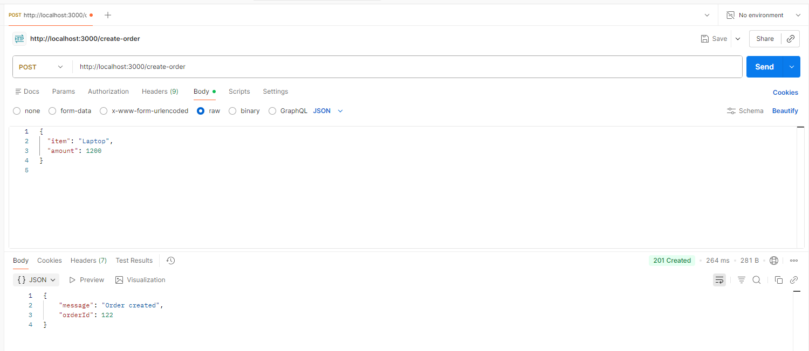
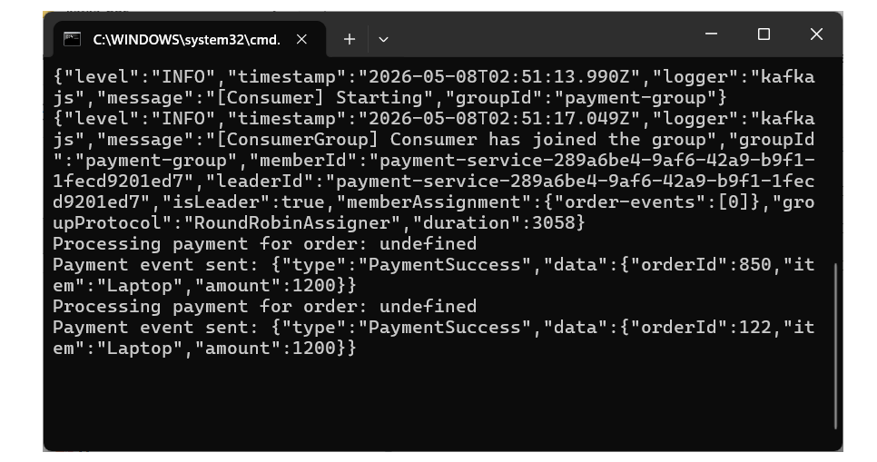
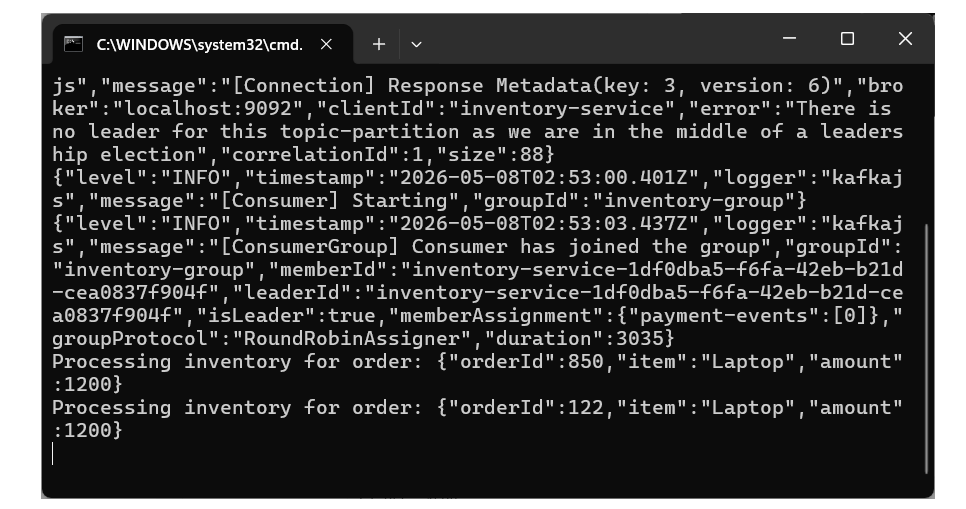
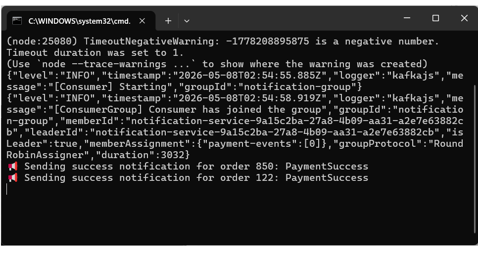

## 🚀 Kafka Event-Driven Order Processing System

## Overview
This project demonstrates a simple event-driven microservices architecture using Kafka, Node.js, and TypeScript.

The system simulates an order processing workflow with multiple independent services communicating via Kafka topics.


---

## Architecture

*   **Order Service (API)** → Kafka (`order-events`) → **Payment Service**
*   **Payment Service** → Kafka (`payment-events`) → **Inventory & Notification Services**
*   Failed messages are routed to a **Dead Letter Queue (DLQ)**.

```text
                +----------------------+
                |   Order API Service  | 
                |  (Producer - Express)|
                +----------+-----------+
                           |
                           v
                   Kafka Topic: order-events
                           |
                           v
                +----------------------+
                |   Payment Service    |
                |     (Consumer)       |
                +----------+-----------+
                           |
        +------------------+------------------+
        |                                     |
        v                                     v
        |                                     |
Kafka Topic: payment-success        Kafka Topic: payment-failed
        |                                     |
        v                                     v
+-------------------+              +----------------------+
| Inventory Service |              | Notification Service |
+-------------------+              +----------------------+

                           |
                           v
                  Dead Letter Queue (DLQ)
               (after retry exhaustion)
```
---

## Features

- Event-driven architecture
- Producer-consumer pattern
- Multiple Kafka topics
- Consumer groups
- Retry mechanism
- Dead Letter Queue (DLQ) handling
- Independent microservices simulation

---

## Project Structure

```text
producer/
consumers/
  ├── payment-consumer.ts
  ├── inventory-consumer.ts
  └── notification-consumer.ts
docker-compose.yml
```

---

## Services

### Order Service (Producer)
- Accepts API requests
- Publishes `OrderCreated` event

### Payment Service
- Processes payment
- Emits `PaymentSuccess` / `PaymentFailed`

### Inventory Service
- Updates inventory only on `PaymentSuccess`

### Notification Service
- Sends success or failure notifications

### DLQ Handler
- Captures failed events after retries

---

## Tech Stack

- Node.js
- TypeScript
- Kafka (KafkaJS)
- Docker
- Express (API)

---

## How to Run

### 1. Start Kafka

```bash
docker-compose up -d
```
### 2. Run Consumers  
```bash
npx ts-node consumers/payment-consumer.ts  
npx ts-node consumers/inventory-consumer.ts  
npx ts-node consumers/notification-consumer.ts
```

### 3. Start API
```bash
npx ts-node producer/order-api.ts
```

### 4. Test API
POST http://localhost:3000/create-order

---

## System Execution Screenshots

### API Request (Postman)



---

### Payment Service Processing



---

### Inventory Service Processing



---

### Notification Service Output



---

## Learning Outcomes
This project demonstrates:

- Event-driven design principles  
- Asynchronous processing  
- Service decoupling  
- Fault tolerance (retry & DLQ)  
- Kafka-based communication patterns

## Request / Response Examples

### Create Order API Request
```http
POST http://localhost:3000/create-order
Content-Type: application/json
```
```
{
  "orderId": "ORD123",
  "userId": "USER1",
  "amount": 250
}
```

## Kafka Event: OrderCreated
```
{
  "eventType": "OrderCreated",
  "orderId": "ORD123",
  "userId": "USER1",
  "amount": 250,
  "timestamp": "2026-05-07T22:00:00Z"
}
```

## Kafka Event: PaymentSuccess
```
{
  "eventType": "PaymentSuccess",
  "orderId": "ORD123",
  "status": "SUCCESS"
}
```

## Kafka Event: PaymentFailed
```
{
  "eventType": "PaymentFailed",
  "orderId": "ORD123",
  "status": "FAILED",
  "reason": "Insufficient funds"
}
```

| Topic Name | Producer | Consumers | Purpose |
| :--- | :--- | :--- | :--- |
| `order-events` | Order Service | Payment Service | New order events |
| `payment-success` | Payment Service | Inventory, Notification | Successful payments |
| `payment-failed` | Payment Service | Notification Service | Failed payments |
| `dlq-events` | Any Service | DLQ Handler | Failed messages after retries |

### Test using curl

```bash
curl -X POST http://localhost:3000/create-order \
-H "Content-Type: application/json" \
-d '{
  "orderId": "ORD123",
  "userId": "USER1",
  "amount": 250
}'
```


### ✅ Retry + Dead Letter Queue (DLQ) Flow

#### Retry Strategy
When a message fails:

*   **Retry processing** (e.g., 3 attempts)
*   **Apply exponential backoff** (1s → 2s → 4s)
*   **Log failure details**

## DLQ Flow
```text
Message Received
        ↓
Processing Failed
        ↓
Retry Attempt 1 ❌
        ↓
Retry Attempt 2 ❌
        ↓
Retry Attempt 3 ❌
        ↓
Send to DLQ ✅
```

## DLQ Event Example
```
{
  "eventType": "PaymentFailed",
  "orderId": "ORD123",
  "failureReason": "Service unavailable",
  "retryCount": 3,
  "originalTopic": "payment-events"
}
```

## Why DLQ is Important
*   **Prevents consumer blocking**: Stops a single "poison pill" message from halting the entire processing pipeline.
*   **Ensures no message is lost**: Provides a safety net for messages that cannot be processed immediately.
*   **Enables debugging of failed events**: Allows developers to inspect the payload and headers of failed messages to identify bugs.
*   **Supports reprocessing later**: Once the underlying issue is fixed, messages can be moved from the DLQ back to the main queue.

---

## ✅ End-to-End Flow Summary
1.  **Client** sends request to **Order API**.
2.  **Order Service** publishes an `OrderCreated` event.
3.  **Payment Service** consumes the event and processes the payment.
4.  **Emits**:
    *   `PaymentSuccess` → Triggers **Inventory** & **Notification** services.
    *   `PaymentFailed` → Triggers **Notification** service.
5.  **On failure**:
    *   **Retry mechanism** triggers automatically.
    *   After **max retries** → Message is moved to the **DLQ**.


